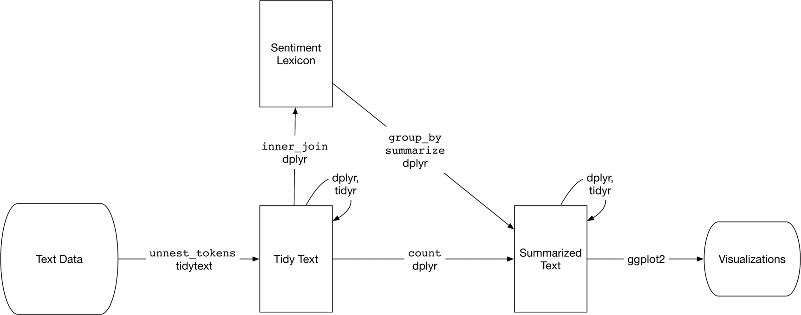

---

Für die Dokumentation des Projekts wird eine R-Markdown Datei gewählt, weil sie das Reproduzieren des Projektes und der Ergebnisse für den Leser vereinfacht. Für die Präsentation der Ergebnisse liegt eine separate PowerPoint-Präsentation vor.

Der nachfolgende Code-Chunk lädt die benötigten Packages und die Textdaten von Twitter.

# Einleitung: Text-Mining am Beispiel der Twitter Posts von Donald Trump

Fragestellung / Problemstellung

Zielsetzung etc.

zweiter schwerpunkt: [Topic modeling - Themenanalyse]

Die Ausarbeitung legt ihren Schwerpunkt auf die Analyse der Themen mit denen sich der Twitter account *@realDonaldTrump* befasst, also [Topic modeling - Themenanalyse]. Daher wird dieses Kapitel etwas ausführlicher ausgelegt. Somit soll die intensive Auseinandersetzung mit der verwendeten Methode sichergestellt werden.

# Grundlagen: Textanalyse und Text-Mining mit R

Im Folgenden soll ein Einstieg in die Textanalyse mit R geboten werden. Die Inhalte bieten die Grundlage für das eigentliche Projekt *"Eine Analyse der Tweets von Donals Trump"*, alias [&#64;realDonaldTrump](https://twitter.com/realdonaldtrump).

## Preprocessing & Exploration

*tidy data*-Prinzipien

Das *'Säubern'* der Textdaten

Ausgangspunkt ist der Text-Mining-Prozess aus der Abbildung:


Dieser Text-Mining-Prozess wird im Folgenden schrittweise ergänzt.

## Sentimentanalyse

Eine Sentimentanalyse (auch Stimmungsanalyse) ist eine spezielle Ausprägung des Text-Minings. Beim Text-Mining werden Daten in Form von Text mit verschiedenen quantitativen und qualitativen Methoden analysiert. Handelt es sich bei den Textdaten um natürliche Sprache, also durch Menschen formulierte und ausgedrückte Texte, spricht man von *Natural Language Processing* (NLP). Weiternoch geht es beim NLP um die Verarbeitung dieser Textdaten und vor allem um deren Interpretation. Die Interpretation kann bspw. durch die Aufnahme von Stimmen (gesprochene Sprache) und anschließende Übersetzung in textuelle Bausteine erfolgen. Interpretation kann außerdem eine Übersetzung von Stimm- oder Textdaten in eine gewisse Semantik dieser Daten bedeuten.

Sentimentanalyse ist das Feststellen der Stimmung bzw. der Polarität eines Textes und wird auch *Opinion Mining* genannt.

> Die Stimmungsanalyse ist eines der Felder der Natural Language Processing, das sich der Erforschung subjektiver Meinungen oder Gefühle widmet, die aus verschiedenen Quellen zu einem bestimmten Thema gesammelt wurden.  
--- Volodymyr Bilyk

Dem Begriff *Sentiment* sind laut Duden die Bedeutungen *Empfindung* sowie *Gefühl* zuzuordnen und ist synonym verwendbar zu *Gemüt*, *Regung* oder *Sinn*. Letztlich ist die Implementierung von Sentimentanalysen verglichen mit anderen fortgeschrittenen statistischen Methoden einfach zu erledigen, wenn man sich lediglich auf die Zuordnung der sog. Sentimente zu den Textabschnitten bezieht. Dies wird lediglich durch bestimmte Arten von *Joins* durchgeführt (s. [Vorgehen und Methoden der Implementierung der Sentimentanalyse]). Sie wird erst durch die Interpretation, die statistische Auswertung und das adäquate Zusammenführen der Daten aus verschiedenen Quellen komplizierter. Komplexität erlangt die Thematik durch Folgendes:

* die Fragestellungen
* der Konzeption der Durchführung
* Auswahl der richtigen Methoden u. Vorgehensweisen
* Reduktion des Problems bzw. der komplexität auf das Wesentliche
* die Interpretaton der Ergebnisse
* Transfer der Ergebnisse aus den Methoden der Sentimentanalyse in weiterführende Methoden


Referenz: https://theappsolutions.com/blog/development/sentiment-analysis/

## Vorgehen und Methoden der Implementierung der Sentimentanalyse

Wenn sich menschliche Leser einem Text nähern, nutzen sie ihre Erfahrung oder Verständnis, das sie über die emotionale Absicht von Wörtern im Laufe ihres Lebens gelernt haben. Daraus leiten sie ab, ob ein Textabschnitt positiv oder negativ ist oder vielleicht durch ein anderes nuancierteres Gefühl wie Überraschung oder Ekel gekennzeichnet ist. Für die programmatische Verarbeitung von Wörtern, können die Werkzeuge des Text-Minings verwendet werden. Die nachfolgende Abbildung ergänzt den Text-Mining-Prozess um entsprechende Inhalte:



Eine Möglichkeit, das Stimmungsbild eines Textes zu analysieren, besteht darin, den Text als eine Kombination seiner einzelnen Wörter und den Stimmungsbildgehalt des gesamten Textes als die Summe des Stimmungsbildes der einzelnen Wörter zu betrachten. Dies ist nicht die einzg mögliche Methode oder Vorgehen, jedoch ist er weit verbreitet. Zudem ist es ein Ansatz mit dem naturgemäß die Vorteile des *'tidy'*-Ökosystems ausgenutzt werden können und außerdem zahlreiche Leitfäden zum Vorgehen vorliegen. Daher wird dieser Ansatz für diese Ausarbeitung gewählt.

## Sentiment-Lexika

### *Inner Join* mit Lexika

That‘s it! Nach den Methoden der „Tidy Data“- Prinzipien wird durch einen relativ einfachen „Join“ (`inner_join`) die Sentimentanalyse implementiert. Auf diese Weise werden aus der Originalquelle nur diejenigen Wörter erhalten, die in beiden Quellen, dem Text und dem Sentiment-Lexikon, enthalten sind.

Theoretisch könnte man an dieser Stelle stoppen. Das Interessante ist nachfolgend, wie man aus den Verknüpfungen zw. Token und Sentimenten Wissen generieren kann.

## Topic modeling - Themenanalyse

In dieser Ausarbeitung wird der zweite Schwerpunkt auf die Analyse der Themen gelegt, mit denen sich der Twitter account *@realDonaldTrump* befasst. Daher wird dieses Kapitel etwas ausführlicher ausgelegt. Somit soll die intensive Auseinandersetzung mit der verwendeten Methode sichergestellt werden.

Bisher wurde gezeigt, dass Wortzahlen und Visualisierungen etwas über Inhalte aussagen. Sentiment-Lexika wurden zum Feststellen der emotionalen Wertigkeit eines Dokuments verwendet. Nun soll über die Wortzahlen hinaus die zugrundeliegenden Themen in einer Sammlung von Dokumenten aufgedeckt werden. Dazu wird ein Wahrscheinlichkeitsmodell für *Dokumente* verwendet. **Latent Dirichlet allocation** (LDA) wurde von David Blei, Andrew Ng und Michael I. Jordan vorgestellt. Es darf nicht mit *Linear discriminant analysis*, ebenfalls abgekürzt mit LDA, verwechselt werden. In diesem Dokument bezieht sich LDA auf *Latent Dirichlet allocation*.

LDA ist ein Standard-Themen-Modell, durch das *topic modeling* implementiert werden kann. Es sucht nach Mustern von Wörtern, die innerhalb und über eine Sammlung von Dokumenten hinweg auftreten, auch bekannt als Korpus (Gesamtheit zusammengehöriger Textdaten). Dabei werden $k$ Themen innerhalb eines Korpus gefunden, indem für jedes Dokument eine separate Sammlung von Wörtern erstellt und Wörter ausgegeben werden, um nach Mustern zu suchen, in denen Wörter zusammengehörig vorkommen. Die Reihenfolge der Wörter ist dabei unerheblich.

Die ausgegebenen Themen sind eine Liste aller Wörter im Korpus, denen eine Auftrittswahrscheinlichkeit innerhalb der Themen zugeordnet wird. Worte, die häufig zusammen auftreten, bekommen höhere $p$-Values (genauer $\beta$-Werte) innerhalb eines oder mehrer Themen zugeordnet.

Da die Methode nach Mustern und Zusammenhängen sucht, statt sie vorherzusagen, kann sie den *Unsupervised Learning*-Algorithmen aus dem Bereich des Maschinellen Lernens zugeordnet werden. *Topic modeling* kann daher mit *Clustering* verwechselt werden. Sie lassen sich trotz ihrer Ähnlichkeit unterscheiden: Gängige Clustering-Techniken wie *k-means* und *hierarchical clustering* basieren auf dem Abstand zwischen Objekten, der ein kontinuierliches Maß ist. Darüber hinaus ist jedes zu gruppierende Objekt einem einzelnen Cluster zugeordnet. Themenmodelle wie LDA basieren auf Worthäufigkeiten, was hingegen ein diskretes Maß ist. Zudem ist jedes Objekt (hier ein Dokument innerhalb eines Korpus) ein Teilmitglied jedes Themas.

Die nachfolgende Grafik erweitert den Text-Mining-Prozess von zuvor um *Topic Modeling*


Das Trainieren des Modells kann mittels der `LDA()`-Funktion implementiert werden. Um es auszuführen muss zunächst eine *Document Term Matrix* (DTM) erstellt und an `LDA()` übergeben werden. Ein `matrix`-Object ist ähnlich aufgebaut zu einem `DataFrame`-Objekt. Jedoch werden die Bestandteile statt *Observation* und *Variable* mit *Zeilen* und *Spalten* bezeichnet, wobei jede Spalte aus einem Datentypen bestehen muss. Eine DTM hat eine Zeile für jedes Document (entspricht im Praxisbeispiel später Tweets) und eine Spalte für jedes einzigartige Word oder Begriff über alle Dokumente in einem Corpus hinweg. Die Werte innerhalb der DTM sind die Zählungen oder Zahl der Verwendung jedes Begriffes innerhalb des zugehörigen Dokuments. Das führt dazu, dass i.d.R. der Großteil aller Werte $0$ enspricht. In einem solchen Fall spricht man von einer *dünnbesetzten Matrix*. Eine DTM kann mithilfe der Funktion `cast_dtm()` erstellt werden. Als Eingabewert erhält sie das *tidy* DataFrame aus den vorherigen Schritten des Preprocessings, das die Wortzählungen enthält. 

Das Trainieren des Modells kann mittels der `LDA()`-Funktion implementiert werden. Sie gibt `LDA`-Objekt zurück, welches die Information über die Auftrittswahrscheinlichkeiten enthält. Sie werden in $\beta$-Werte übersetzt, welche letztlich interpretiert werden können. 

```{r eval=FALSE}
library(topicmodels)

lda_fitted <- LDA(
  dtm_input,
  k = 2,
  method = "Gibbs",
  control = list(seed = 42)
)
```
Der code-Chunk zeigt die Verwendung von `LDA()`. Das erste Argument ist die DTM. Das zweite Argument `k` gibt an, wie viele Themen bestimmt werden sollen. `method` gibt die zu verwendene Schätzmethode an. Der *Default* Wert hier wäre eine schnelle Annäherung. Wenn jedoch vollständigere Methode aber dafür mit längerer Laufzeit bevorzugt wird, sollte der *Gibbs*-Sampler verwendet werden. Es kann zudem ein optionaler Seed gesetzt werden, um Repruduzierbarkeit zu unterstützen. Die Laufzeit der Methode kann bis zu einige Stunden betragen.

Das trainierte Modell ist ein spezielles R-Objekt, das für das Package `topicmodels` kodiert ist, wie es auch bei dem DTM der Fall ist. Funktionen wie `str()`, `summary()` oder `glimpse()` können den Inhalt des Modells anzeigen.

```{r eval=FALSE}
glimpse(lda_fitted)
```

Die Evaluierung des Modell-Objekts kann mithilfe eines der Werkzeuge aus dem `tidytext` Package erledigt werden. Insbesondere sind die wichtigsten Ergebnisse eines Themenmodells die Themen selbst: das Wörterbuch aller Wörter im Korpus, sortiert nach der Wahrscheinlichkeit, mit der jedes Wort im Rahmen dieses Themas auftritt. In diesem Fall kann die `tidy()`-Funktion die Matrix mit Auftrittswahrscheinlichkeiten der Themen in eine Form umwandeln, die erneut den *Tidy-Data*-Prinzipien folgt und somit auf einfache Weise mit `ggplot2` zur Visualisierung verwendet werden kann. Die Auftrittswahrscheinlichkeiten $\beta$ sollten zudem absteigend sortiert werden:

```{r eval=FALSE}
lda_fitted %>%
  tidy(matrix = "beta") %>%
  arrange(desc(beta))
```

Es resultiert die geordnete Auflistung der Wahrscheinlichkeiten. Es steht nun die Frage aus, wie man entscheiden soll, wie $k$ zu definieren ist. $k$ gibt die Anzahl der Themen an, nach denen `LDA` suchen soll. Die Antwort auf diese Frage steht im direkten Zusammenhang mit der Interpretation des Modells. Ein *Topic Model* zu interpretieren ist ein subjectiver Prozess. Denn wie auch bei anderen *Unsupervised Learning* Methoden, wie bspw. *Clustering*, gibt der Output der Modelle an, woraus die Cluster bestehen. Es fehlt jedoch eine Beschreibung der Richtung, ein Hinweis auf die Bedeutung der Ergebnisse. Die Bedeutung kann nicht trennscharf durch die Methoden bestimmt werden. Hier könnten bspw. Missverständnisse je nach unterschiedlicher Kultur der Betrachter auftreten. Gleichwohl könenn ganz andare, unerwartete Dimensionen als Stöfaktor in die Bewertung eingehen. Die Entscheidung also, wie viele Themen zu bestimmen sind, hängt vom Betrachter ab. Die **Schlüsselerkenntnis** hier sollte sein, dass $k$ so gewählt sind, dass die Ergebnisse ausreichend unterschiedlich zueinander sind, sodass der Betrachter sinnhafte Erkenntnisse extrahieren kann. Die Themen sollten sich nicht wiederholen. 

Grundsätzlich kann man sich an folgendes Muster halten:

* weitere Themen hinzuzunehmen ($k$ erhöhen), ist so lange in Ordnung, wenn sie unterschiedlich zueinander sind
* wenn Themen sich wiederholen, wird $k$ zu groß
* Themen sollten durch einen *Überschrift* oder ein *Name* beschrieben werden, um sie greifbarer für die Interpretation zu machen

Die Implementation und das Ergebnis einer *Latent Dirichlet Allocation* wird im Praxisteil deutlich.

Referenz: https://www.tidytextmining.com/topicmodeling.html

# Dokumentation der Durchführung der Textanalyse

Der nachfolgende Code-Chunk lädt die benötigten Packages und die Textdaten von Twitter.

```{r results=FALSE}
if(!require('tidyverse')){
  install.packages('tidyverse')}; library('tidyverse')

if(!require('tidytext')){
  install.packages('tidytext')}; library('tidytext')

if(!require('textdata')){
  install.packages('textdata')}; library('textdata')

if(!require('syuzhet')){
  install.packages('syuzhet')}; library('syuzhet')

if(!require('lubridate')){
  install.packages('lubridate')}; library('lubridate')

if(!require('topicmodels')){
  install.packages('topicmodels')}; library('topicmodels')

if(!require('jsonlite')){
  install.packages('jsonlite')}; library('jsonlite')

if(!require('scales')){
  install.packages('scales')}; library('scales')

tweets <- as.tbl( fromJSON('src/tweets-2019-06-22.json') )
```

## Beschreibung der Daten

Die Textdaten (engl. *dataset*)...

```{r}
glimpse(tweets)
```

## Preprocessing & Tidying

Beim ersten Inspizieren der geladenen Daten fällt zunächst auf, dass die Angabe über das Tweet-Erstellungsdatum (`created_at`) als `character` formatiert ist: 

```{r}
class(tweets$created_at)
```

Diese Variable wird als Datumsangabe benötigt. Mit der Funktion `as.POSIXct` lassen sich Datumsangaben nach dem POSIX-Standard erzeugen, welche sich gut mit R verarbeiten lassen. Die Zeitangaben aus der Quelle lassen sich mittels `strptime` von `character` Repräsentationen in POSIX\*-Objekte konvertieren. Zusätzlich muss für die Tweet Analyse bedacht werden, dass es sich bei den Zeitangaben i.d.R. nicht um die Zeitzone handelt, die wir in Mitteleuropa normalerweise verwenden (GMT, bzw. UTC). Wenn wir die Tweets des Accounts *@realDonaldTrump* untersuchen, ist es jedoch sinnvoll, die Zeitangaben in der Zeitzone des Besitzers zu beschreiben, um die Zeitverschiebung zu berücksichtigen.

```{r}
# prev <- Sys.getlocale("LC_TIME") # falls abweichend von "German_Germany.1252"
german <- "German_Germany.1252"
Sys.setlocale("LC_TIME", "C") # auf windows system muss zunächst die locale angepasst werden

POSIX_times_formatted <- strptime(tweets$created_at, "%a %b %d %H:%M:%S %z %Y")

# Trumpian time
tweets$created_at <- with_tz(as.POSIXct(POSIX_times_formatted), "EST")

Sys.setlocale("LC_TIME", german)
```

```{r}
summary(tweets)
```

Ein großer Teil der Analysen zielen darauf ab, die Source des Tweets zu unterscheiden. Es wird häufig behauptet, dass Unterschiede im Posting-Verhalten zwischen Posts von einem iPhone und Android Device festgestellt werden können. Diese Analyse soll bestätigen, dass dem so ist. Man weiß, dass Donald Trump zumindest eine Zeit lang ein Android Device verwendete (https://www.theverge.com/2015/10/5/9453935/donald-trump-twitter-strategy). Dieser Zeitraum kann festgestellt werden:

```{r}
unique(tweets$source)
```

```{r}
min(tweets[tweets$source == "Twitter for Android",]$created_at)
max(tweets[tweets$source == "Twitter for Android",]$created_at)
```

Für den Twitter-Account *@realDonaldTrump* wurde im Zeitraum Februar 2013 bis März 2017 unter anderem ein Android Device verwendet. Das gesamte Dataset wird auf diesen Zeitraum eingeschränkt, um sicherszustellen, dass in die Analysen keine Tweets einfließen, zu dessen Zeitpunkt das Android Device nicht existierte. Datei wird von vollen Jahren ausgegangen, also 01.01.2014 bis 31.12.2016. Außerdem wird auf Android und iPhone Devices eingeschränkt. Zusätzlich wird das Dataset weiter "gesäubert":

```{r}
names(tweets) <- c("device", "text", "created", "retweet_count", "favorite_count", "is_retweet", "id")
names(tweets)
```

```{r}
tweets <- tweets %>%
  mutate(device = str_replace(device, "Twitter for ", "")) %>%
  filter(device %in% c("Android", "iPhone") &
           created >= "2014-01-01" &
           created <= "2016-12-31") %>%
  select(id, device, created, text)

tweets$device <- as.factor(tweets$device)
tweets[1:5,]
```

## Exploration

Eine Betrachtung der *Absolut*-Zahlen / Zählungen der Posts je Device:

```{r}
tweets %>%
  count(device) %>%
  mutate(percent = n/sum(n))
```
Das Android Device wird wesentlich reger verwendet. Ein Hinweis darauf, dass wir in den folgenden Analysen, wo sinnvoll, relative Werte verwenden sollten, um somit dem Klassifizierungs-Überhang (engl. Prevalence) der Klasse *'Android'* entgegenzuwirken.

---

Wann Postet der Twitter Account *@realDonaldTrump* ? Die Zeiten wurden hierfür bereits in die richtige Form gebracht (s.o.), denn hier ist vor allem die Zeitzone zu beachten.

```{r fig.height=6, fig.width=9}
tweets %>%
  mutate(hour = hour(created)) %>%
  count(device, hour) %>%
  group_by(device) %>%
  mutate(percent = n / sum(n)) %>%
  ungroup() %>%
  ggplot(aes(hour, percent, color = device)) +
  geom_line(size = 1.1) +
  scale_y_continuous(labels = percent_format()) +
  theme(legend.position = 'bottom') +
  labs(title = "Anteilige Tweets pro Uhrzeit u. Device",
       x = "Tageszeit (EST)",
       y = "% Tweets p. Device",
       color = "")
```

---

Über den Account *@realDonaldTrump* werden Tweets anderer User retweetet. Ein Tweet wird als Retweet eingeordnet, wenn er mit doppelten Anführungszeichen (*"*) beginnt. Andere Twitter User machten die Beobachtung, dass *@realDonaldTrump* diese besondere Angewohnheit für das Retweeten hat (statt die dafür eigentlich vorgesehene Funktion oder den gängigen Kürzel '*RT*' zu verwenden). Die folgende Grafik zeigt, auf welche Devices sich diese Retweets verteilen:

```{r}
tweets %>%
  count(device, quoted = ifelse(str_detect(text, '^"'), "RT", "nicht-RT")) %>%
  ggplot(aes(device, n, fill = quoted)) +
  geom_bar(stat = "identity", position = "dodge") +
  labs(title = 'Analyse der Tweet Texte\n"-Zeichen zu Beginn',
       x = "",
       y = "Anzahl Tweets",
       fill = "")
```

Es ist erkennbar, dass die meisten Retweets tatsächlich vom Android Device stammen. Das unterstützt weiterhin die Hypthese, dass ein Unterschied zwischen den

---

Ein weiterer Unterschied, der anhand der Daten belegt werden kann ist folgender: Vom Android Device wird selten bis nie ein Link oder ein Bild gepostet. Der Präsident scheint dazu zu tendieren, Tweets wie die folgenden zu schreiben:

```{r}
tweets %>% filter(str_detect(text, "Very dishonest!")) %>% .$text
```

Während *The Ghost* via iPhone bisweilen Ankündigungen, Danksagungen oder sonstige Grüße ausspricht:
```{r}
tweets %>% filter(str_detect(text, "Thank you W")) %>% .$text
```

Diese Tweets sind zudem in einem ähnlichen Muster geschrieben, als diene eine interne Vorgabe als Vorlage. Zudem ist der Anteil an Hashtags (#) wesentlich höher als in den Tweets des Präsidenten, was weiter unten noch untermauert wird. Hier zunächst die Darstellung der Zählungen der Tweets mit und ohne Links/Bildern:

```{r}
#  Anzahl der Tweets mit und ohne Bild-Link pro Device bestimmen
tweets_pictures <- tweets %>%
  filter(!str_detect(text, '^"')) %>%
  mutate(picture = ifelse(
    str_detect(text, "t.co"),
    "Bild-Link",
    "nicht Bild-Link")) %>%
  count(device, picture)

# bar plot
ggplot(tweets_pictures, aes(device, n, fill = picture)) +
  geom_col(position = position_dodge()) +
  labs(title = "Analyse nach Bildern in Tweets pro Device",
       x = "",
       y = "Anzahl Tweets",
       fill = "")
```

---

Der Unterschied zwischen den beiden Devices ist hinreichend nachgestellt worden. Nun wird der Inhalt der Tweets betrachtet, um somit einer Aussage näher zu kommen, ob der Präsident einen oder mehrere *Ghosts* für seinen Twitter Account beschäftigt, so lautet schließlich die Hypothese.

Für diese Analyse werden die Tweets im strengen *Tidy*-Format benötigt. Dazu wird wie zuvor beschrieben die Funktion `unnest_token` verwendet. Es erfolgen weitere Schritte:

* Die Bild-Links werden mit `str_replace_all` entfernt (das regex lautet `"https://t.co/[A-Za-z\\d]+|&amp;"`).
* Es werden außerdem mittels des DataFrames `stop_words` aus dem `tidytext` Package Wörter ohne relevante Aussagekraft aus dem Analyse-Dataset entfernt.
* Für `unnest_tokens` wird ein benutzerdefiniertes Muster verwendet: `([^A-Za-z\\d#@']|'(?![A-Za-z\\d#@]))`, welches in der Lage ist Erwähnungen anderer Nutzer (@...) und Hashtag-Nennungen (#...) zu erhalten. Die *default*-Werte der Funktion würden Sonderzeichen wie diese entfernen.
* Vorrangig Ziffern werden mit `str_detect(word, "[a-z]")` herausgefiltert.

```{r}
tweets_tidy <- tweets %>%
  filter(!str_detect(text, '^"')) %>%
  mutate(text = str_replace_all(text, "https://t.co/[A-Za-z\\d]+|&amp;", "")) %>%
  unnest_tokens(word, text, token = "regex", pattern = "([^A-Za-z\\d#@']|'(?![A-Za-z\\d#@]))") %>%
  filter(!word %in% stop_words$word,
         str_detect(word, "[a-z]"))

tweets_tidy[1:5,]
```

Nun können die häufigsten Wörter ausgegeben werden:

```{r}
tweets_tidy %>%
  count(word, sort = T) %>%
  top_n(15, n) %>%
  mutate(word = reorder(word, n)) %>%
  ggplot(aes(word, n)) +
  geom_col() +
  coord_flip() +
  ggtitle("Die häufigsten Wörter insgesamt")
```

---

Möchte man nun die Verwendung von Worten je Device betrachten, kann man sich das *Quotenverhältnis* zur Hilfe nehmen. Dies ist die bessere Variante als ein schlichter Vergleich der Zählungen, weil wie zuvor beschrieben somit der Überhang der Klassifizierung *'Android'* beachtet wird. David Robinson aus der Data Science Community dient als Referenz für die nachfolgende Statistik. Das Log-Quotenverhältnis (auch *Odd-Ratio*) berechnet sich wie folgt:

$$
\log_2
\left(
  \frac
    {\frac{\text{# von Android}+1}{\text{Gesamt # Wörter Android}+1}}
    {\frac{\text{# von iPhone}+1}{\text{Gesamt # Wörter iPhone}+1}}
\right)
$$

Die Wörter werden für die Analyse auf ein Vorkommen von mindestens fünf Mal auf beiden Devices eingeschränkt. In einigen Fällen bedeutet das, dass weniger Vorkommen von dem Android Device als vom iPhone gezählt werden, jedoch nie weniger als fünf insgesamt. Wenn ein Wort auf dem Android einmalig auftritt, dann fallen die restlichen vier dem iPhone Device zu.

```{r}
tweets_ratios <- tweets_tidy %>%
  count(word, device) %>%
  group_by(word)  %>% 
  filter(sum(n) >= 5) %>%
  spread(device, n, fill = 0) %>%
  ungroup() %>%
  mutate_if(is.numeric, list(~ (. + 1) / sum(. + 1))) %>%
  mutate(oddratio = log2(Android / iPhone)) %>%
  arrange(desc(oddratio))

tweets_ratios[1:5,]
```

Im Anschluss können die meist verwendeten Wörter, geordnet nach den *Odd-Ratios*, geplottet werden. Eine explizite Unterscheidung der Device-Klassen ist nun nicht mehr möglich, weil die Raten über die Klassen hinweg erstellt wurden. Jedoch wurde die Berechnung so ausgelegt, dass die Quotenverhältnisse aus Sicht der Klasse *'Android'* definiert sind. Somit können Werte größer als Null dem Android Device und Werte kleiner Null iPhone zugeordnet werden:

```{r}
tweets_ratios %>%
  group_by(oddratio > 0) %>%
  top_n(15, abs(oddratio)) %>%
  ungroup() %>%
  mutate(word = reorder(word, oddratio)) %>%
  ggplot(aes(word, oddratio, fill = oddratio < 0)) +
  geom_bar(stat = "identity") +
  coord_flip() +
  ylab("Android / iPhone Log-Odd-Ratio") +
  scale_fill_manual(name = "", labels = c("Android", "iPhone"),
                    values = c("red", "lightblue"))
```

Bis hierhin lassen sich die ersten Erkenntnisse der Explorativen Analyse zusammenfassen:

* Es ist tatsächlich so, dass die meisten Hashtag-Markierungen vom iPhone stammen. Wenn der Präsident Hashtags verwendet, sind das allenfalls Hashtags aus Retweets.
* Das iPhone ist für offizielle Ankündigungen im Stil von Einladungen verantwortlich. Das Erkennt man an Wortfragmenten wie *"7pm"* oder *"join"* (*"Join me in Houston, Texas tomorrow night at 7 pm!"*)
* Emotionalere Tweets stammen vom Präsidenten selbst. Worte wie "poorly" oder "stupid" sind nicht nur Worte, die untypisch für eine Campagne oder eine offizielle Stelle sind, sie sind auch eindeutig dem Android und demnach dem Präsidenten zuzuordnen, wenn man die Hypthese zu unterstützen versucht.

## Sentiment-Analyse

Für den erstem Teil der Sentimentanalyse werden die Ergebnisse aus der vorherigen Analyse mit dem "NRC" Sentiment-Lexikon verknüpft. Dieses Sentiment-Lexikon wird hier mit `get_sentiment_dictionary` aus dem `syuzhet` Package geladen, weil es seit der neusten Version von `tidytext` nicht mehr zur Verfügung steht.

Es werden die Sentimente mit den zehn meist verwendeten Wörtern, geordnet nach den absoluten Werten der Quotenverhältnisse, ausgewertet und anschließend visualisiert:

```{r}
nrc <- get_sentiment_dictionary("nrc") %>%
  select(word, sentiment)

tweets_sentiments <- tweets_ratios %>%
  inner_join(nrc, by = "word") %>%
  filter(!sentiment %in% c("positive", "negative")) %>%
  mutate(sentiment = reorder(sentiment, -oddratio),
         word = reorder(word, -oddratio)) %>%
  group_by(sentiment) %>%
  top_n(10, abs(oddratio)) %>%
  ungroup()

tweets_sentiments[1:5,]
```

```{r}
# Plot the log odds ratio of words by device in groups sentiments
ggplot(tweets_sentiments, aes(word, oddratio, fill = oddratio < 0)) +
  facet_wrap(~ sentiment, scales = "free", nrow = 2) +
  geom_col() +
  theme(axis.text.x = element_text(angle = 90, hjust = 1)) +
  labs(x = "", y = "Android / iPhone Odd-Ratio") +
  scale_fill_manual(name = "", labels = c("Android", "iPhone"),
                    values = c("red", "lightblue"))
```


## Topic Modeling


https://dzone.com/articles/text-analysis-of-trumps-tweets-confirms-he-writes

# Zusammenfassung der Ergebnisse